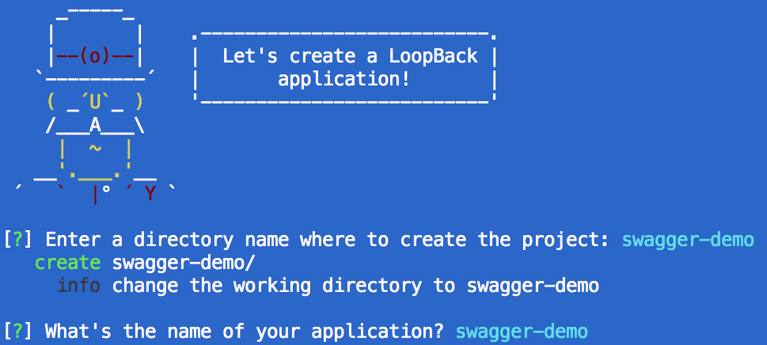
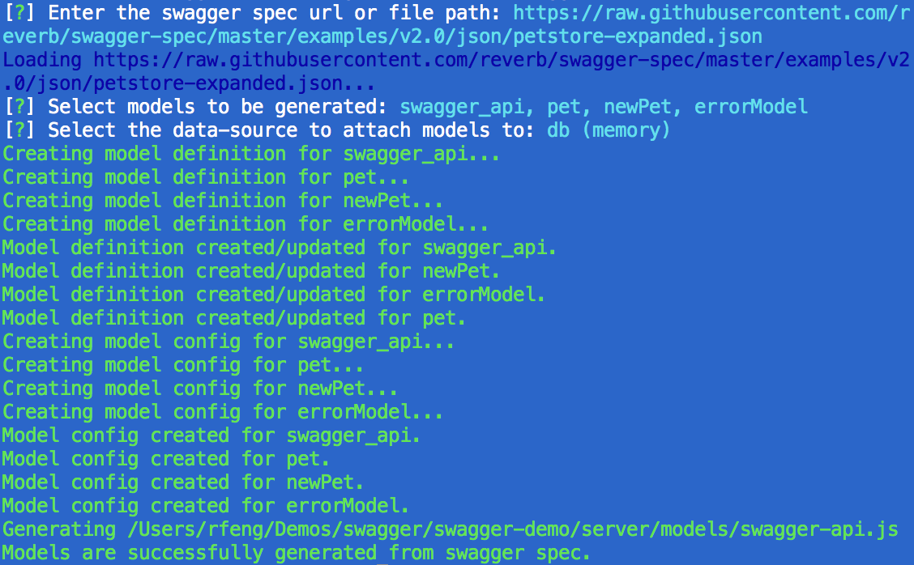
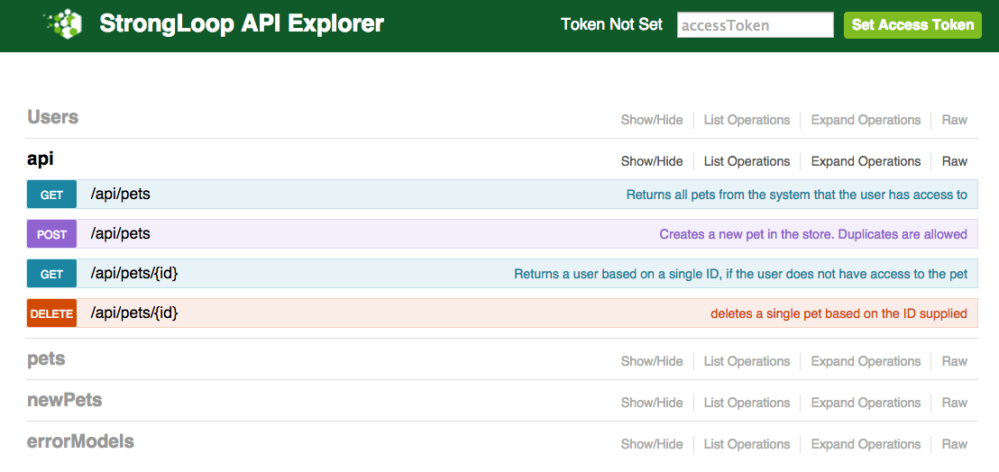
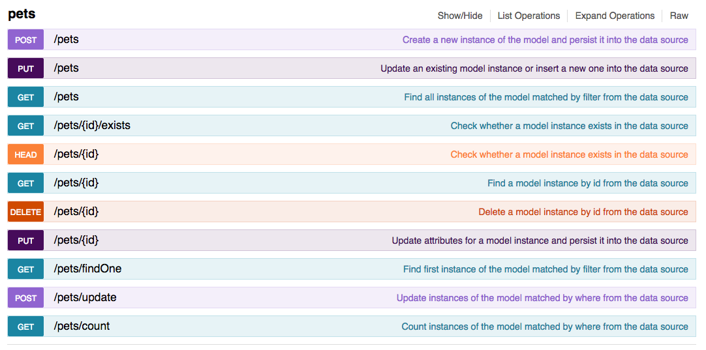
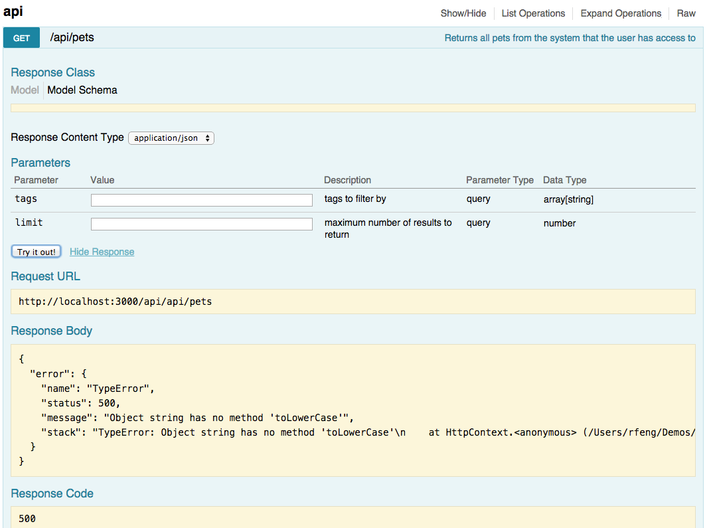

# API design first with LoopBack and Swagger

## What is LoopBack?

[LoopBack](http://loopback.io) is an open source Node.js API framework from 
[StrongLoop](http://www.strongloop.com). It is built on top of Express 
optimized for mobile, web, and other devices. LoopBack makes it really easy 
and productive for developers to define, build and consume APIs. Define data 
models, connect to multiple data sources, write business logic in Node.js, 
glue on top of your existing services and data, and consume using JS, iOS & 
Android SDKs.

## What is Swagger?

[Swagger](https://github.com/reverb/swagger-spec) defines a standard, 
language-agnostic interface to REST APIs which allows both humans and computers 
to discover and understand the capabilities of the service without access to 
source code, documentation, or through network traffic inspection.

## LoopBack + Swagger = API business


LoopBack comes with a Swagger based API explorer since day one to provide 
instant visibility for REST APIs exposed by LoopBack models. So far with 
LoopBack, most developers define models and implement the API logic in Node.js.
The JavaScript methods are annotated with remoting metadata so that they can be
exposed as REST APIs. LoopBack publishes such definitions as Swagger specs in 
JSON format. The API explorer creates an API playground based on the specs. 

What about starting with an API design spec? API consumers and providers often
want to discuss, understand, and agree on the APIs as the contract first before
building code for either side. To support API design first approach, we're happy
to announce the availability of loopback:swagger generator which can generate a
fully-functional application that provide the apis conforming to the swagger 
specification. 

## Scaffolding a LoopBack application from swagger specs

Before we start, please make sure you have StrongLoop tools installed:

```sh
npm install -g strongloop
```
For more information, see http://docs.strongloop.com/display/LB/Getting+Started+with+LoopBack.

### Create a loopback application

The first step is to create a blank loopback application.

```sh
slc loopback
```



### Generate APIs from swagger spec

Now let's try to generate apis from swagger specs.

```sh
cd swagger-demo
slc loopback:swagger
```
When prompted, first provide a url to the swagger spec. In this demo, we use:

https://raw.githubusercontent.com/reverb/swagger-spec/master/examples/v2.0/json/petstore-expanded.json


The generator loads the spec and discovers models and apis. It then prompts you
to select from the list of models to be created.




### Check the project

The models and corresponding JS files are generated into the server/models folder:


- server/model-config.json: Config for all models

- server/models:

  - swagger-api.json: model to host all swagger APIs
  - swagger-api.js: JS file containing all api methods
  - error-model.json: errorModel model definition
  - error-model.js: errorModel extension
  - pet.json: pet definition
  - pet.js: pet model extension
  - new-pet.json: newPet model definition
  - new-pet.js: newPet model extension

Please note pet/newPet/errorModel models are now connected to the database selected.

### Run the application

To run the application:
```sh
node .
```

Open your browser and points to http://localhost:3000/explorer.



As you see, the api endpoints defined by the swagger spec is now available from
LoopBack!

You'll also see a list of models generated too. As illustrated below, these
models have the full CRUD capabilities and can be attached any of the databases
that LoopBack supports.



Let's give a try:



Hmm, you get an error saying the api is not implemented. That is expected as the
generated method is just a skeleton!

How to add your implementation?

The file can be found at swagger-demo/server/models/swagger-api.js.

```js
module.exports = function(SwaggerApi) {

/**
 * Returns all pets from the system that the user has access to
 * @param {array} tags tags to filter by 
 * @param {integer} limit maximum number of results to return
 * @callback {Function} callback Callback function
 * @param {Error|String} err Error object
 * @param {errorModel} result Result object
 */
SwaggerApi.findPets = function (tags, limit, callback) {
  // Add your implementation here. Please make sure the callback is invoked
  process.nextTick(function() {
    var err = new Error('Not implemented');
    callback(err);
  });
  
}
...
SwaggerApi.remoteMethod('findPets',
  { isStatic: true,
  produces: [ 'application/json', 'application/xml', 'text/xml', 'text/html' ],
  accepts: 
   [ { arg: 'tags',
       type: [ 'string' ],
       description: 'tags to filter by',
       required: false,
       http: { source: 'query' } },
     { arg: 'limit',
       type: 'number',
       description: 'maximum number of results to return',
       required: false,
       http: { source: 'query' } } ],
  returns: 
   [ { description: 'unexpected error',
       type: 'errorModel',
       arg: 'data',
       root: true } ],
  http: { verb: 'get', path: '/pets' },
  description: 'Returns all pets from the system that the user has access to' }
);
```

Let's use the Pet model to implement the corresponding methods:

```js
SwaggerApi.findPets = function(tags, limit, callback) {
  var filter = {limit: limit};
  if (tags && tags.length) {
    filter.where = {tag: {inq: tags}};
  }
  SwaggerApi.app.models.pet.find(filter, callback);
}

SwaggerApi.addPet = function (pet, callback) {
  SwaggerApi.app.models.pet.create(pet, callback);
  
}

SwaggerApi.findPetById = function (id, callback) {
  SwaggerApi.app.models.pet.findById(id, callback);
  
}

SwaggerApi.deletePet = function (id, callback) {
  SwaggerApi.app.models.pet.deleteById(id, callback);
  
}
```

Now you can restart the server and try again:

1. Try `getPets`. You'll see an empty array coming back.
2. Try `addPet` to post one or more records to create new pets.
3. Try `getPets` again. You'll see the newly created pets.
4. Try `findPetById`. You should be look up pets by id now.
5. Try `deletePet`. Pets can be deleted by id.

You can also use the `pet` model directly. It will provide you the full CRUD
operations.

## Swagger versions

The LoopBack swagger generator supports both [2.0](https://github.com/reverb/swagger-spec/blob/master/versions/2.0.md) 
and [1.2](https://github.com/reverb/swagger-spec/blob/master/versions/1.2.md) versions. 
Feel free to try it out with the pet store v1.2 spec at http://petstore.swagger.wordnik.com/api/api-docs. 
Please note in 1.2, the spec URL can be the resource listing or a specific api 
specification. For resource listing, all api specifications will be automatically
fetched and processed. 


## Summary

With the swagger generator, we now have the complete round trip: 
- Start with a swagger spec
- Generate corresponding models and methods for your application
- Implement the remote methods
- Play with the live APIs served by LoopBack using the explorer
